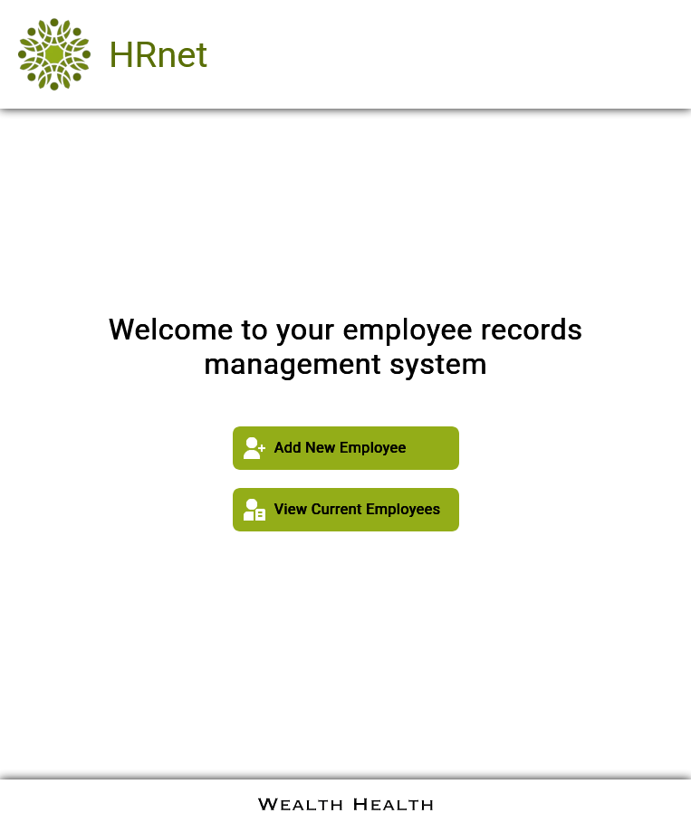
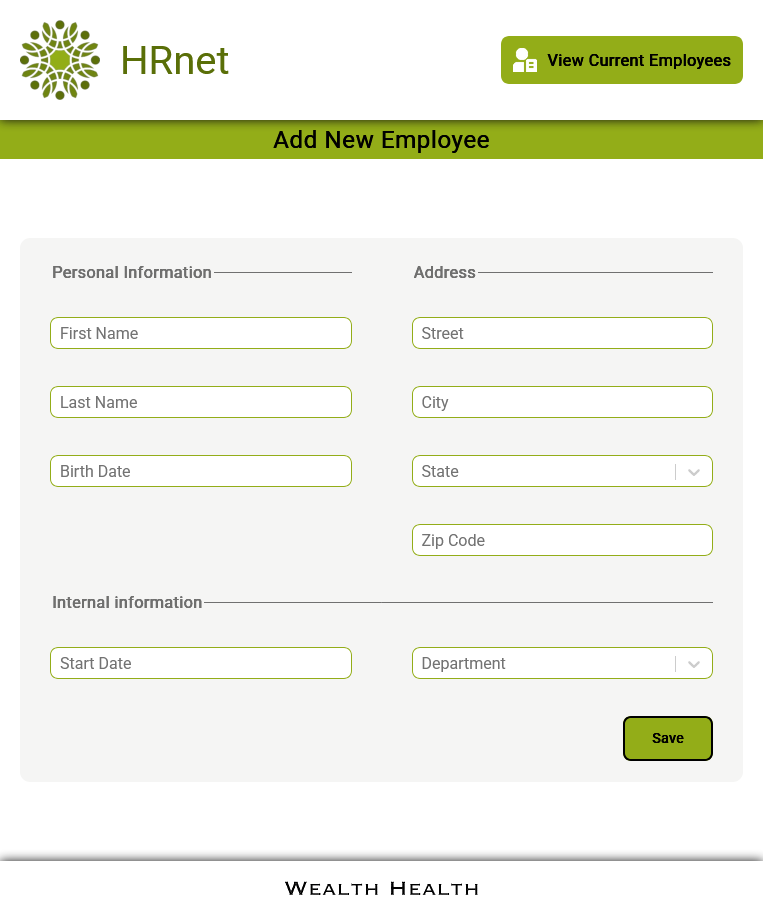
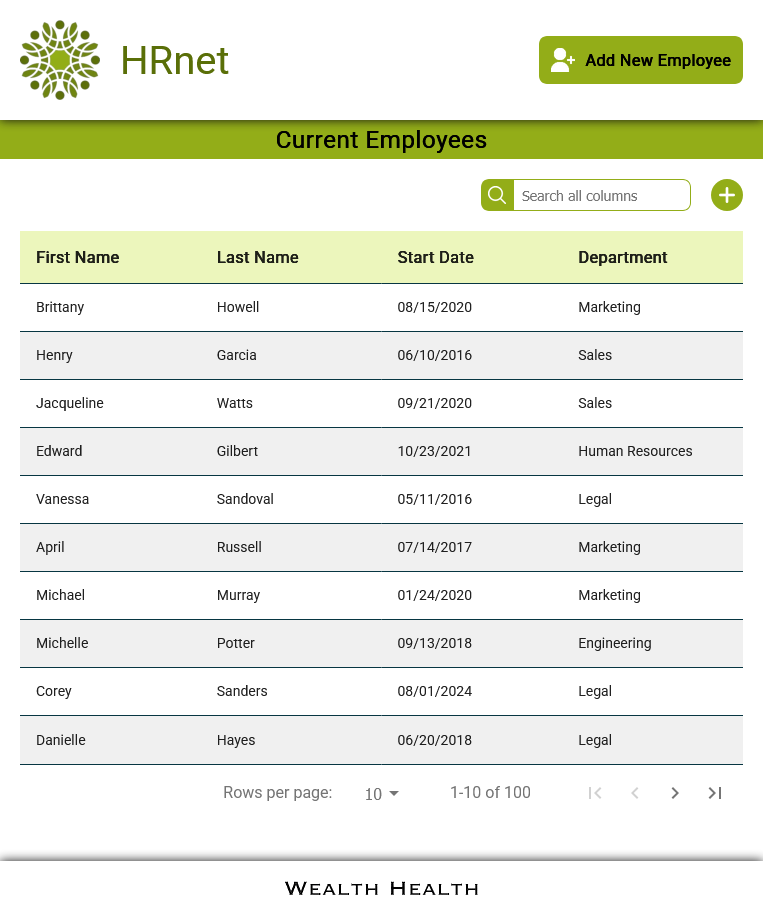

# HR Net


passer une librairie jQuery vers React.  

  
> [!NOTE]  
> L'application était ancienne et utilisait jQuery côté front end, ce qui entraînait des bugs et une augmentation des plaintes en interne.

#  React +  Vite

Ce projet est une application React configurée avec Vite.

## Prérequis

Avant de commencer, vous devez avoir installé les éléments suivants sur votre machine :

- **Node.js**
- **npm**

## Installation

Suivez les étapes ci-dessous pour configurer ce projet localement :

1. Clonez le dépôt du projet :
   ```bash
   git clone https://github.com/PierreTDX/P14_HRnet_OC.git

2. Allez dans le dossier du projet :
   ```bash
   cd nom-du-dossier

3. Installez les dépendances du projet :
   ```bash
   npm install

## Lancer l'application

Pour démarrer l'application en mode développement, exécutez la commande suivante :
   ```bash
   npm run dev
   ```

## Build pour la production

Pour créer une version optimisée de l'application pour la production, exécutez :
   ```bash
   npm run build
   ```
   Cette commande génère un dossier dist/ contenant tous les fichiers nécessaires pour déployer l'application.

## Déploiement

Ce projet est prêt à être déployé sur Vercel  
Pour déployer le projet sur Vercel, suivez ces étapes :

- Poussez votre code vers GitHub ou GitLab.
- Connectez votre dépôt à Vercel.
- Vercel détectera automatiquement qu'il s'agit d'une application React et lancera le processus de déploiement.  

L'application est dépoyée ici : [https://p14-hrnet-oc.vercel.app/](https://p14-hrnet-oc.vercel.app/)

## Technologies utilisées

- **React**          - Framework JavaScript pour la création d'interfaces utilisateur.
- **Vite**           - Outil de build rapide pour les applications React.
- **SASS**           - Préprocesseur CSS pour une meilleure gestion des styles.

## Bibliothèques tierces

- [**@ptdx/modal**](https://www.npmjs.com/package/@ptdx/modal)                - Composant personnalisé léger pour afficher des fenêtres modales réutilisables dans les interfaces React.
- **react-hook-form**            - Bibliothèque de gestion de formulaires pour React.
- **react-data-table-component** - Composant React pour l'affichage de tableaux interactifs, avec tri, pagination et filtre.
- **react-select**               - Composant React personnalisable pour des menus déroulants avec recherche et sélection dynamique.
- **react-datepicker**           - Composant React pour la sélection de dates via une interface utilisateur.

## Aperçu de l'application





